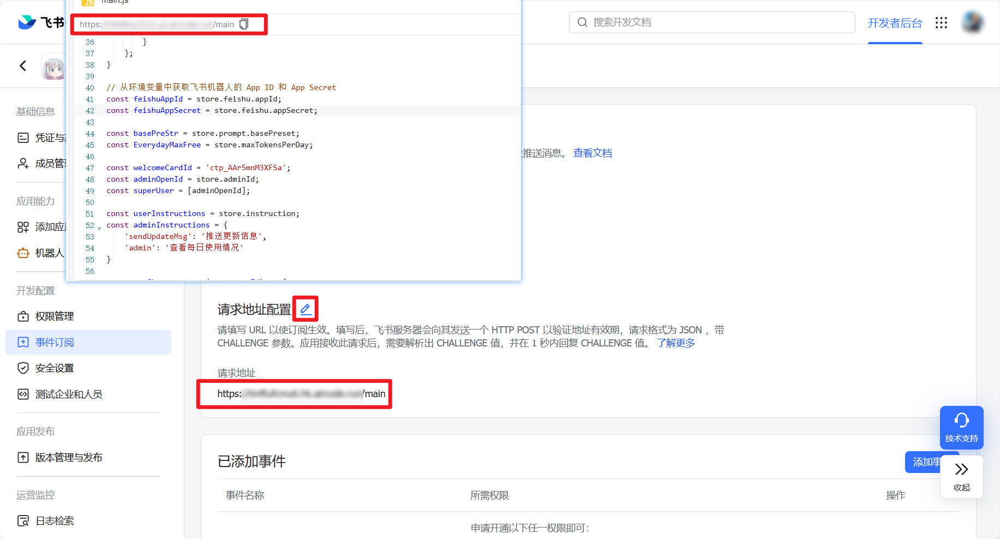

<h1 align='center'>🌸 连接飞书与chatGPT 🌊</h1>

**版权声明**

本项目是基于 [Feishu-ChatGPT(aircode.cool)](https://aircode.cool/q4y1msdim4) 的二次开发,笔者尊重原作者的劳动成果,在此感谢原作者的贡献.

在进行二次开发时,笔者致力于保留原始仓库的核心功能，并添加新的特性以提供更优质的服务.

## ✨ 新增特性

- 🌈 现在,聊天机器人支持上下文对话的功能了!
- 💬 用户可以使用`/preset`指令为机器人设置不同的人格.
- 🎨 用户可以使用 GPT4 啦（需要具有支持 GPT4 的API,否则会报错）

## 🐳 部署相关

**一键部署**：

	

**环境变量配置**: 参考[飞书 ChatGPT 机器人 - (aircode.cool)](https://aircode.cool/q4y1msdim4)进行配置

| key             | value               |
| --------------- | ------------------- |
| feishuAppId     | 飞书应用凭证 id     |
| feishuAppSecret | 飞书应用凭证 secret |
| OpenAISecret    | OpenAi 的 API-key   |

完成环境变量配置之后请点击 `deploy`

**定时任务配置**: (在`deploy`完成后)

**飞书配置**：

